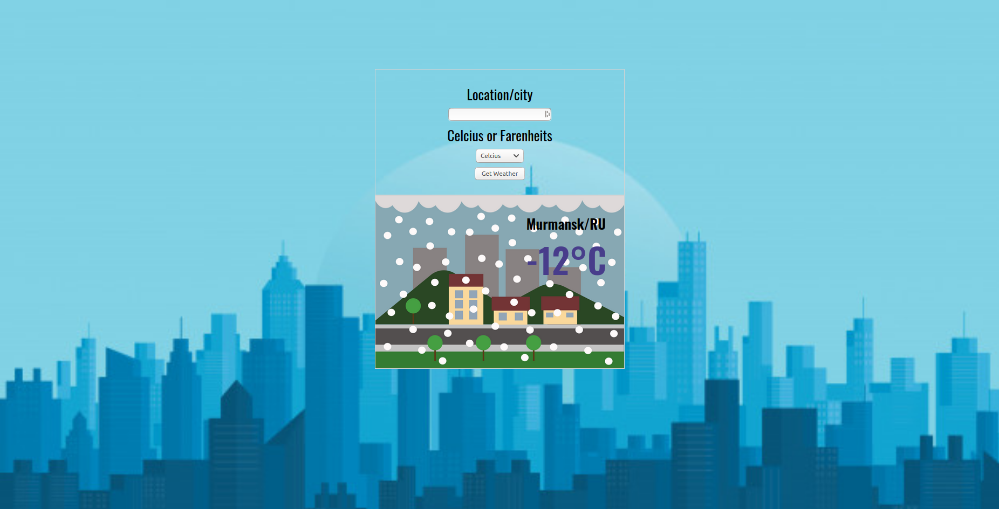

# weather-app

The weather app project was built as the fourth project of the JavaScript module from Microvers. Here you can look for the current weather of a city arround the world.
For this I use the Openweathermap API. 

##  :hammer: Built with:

- Html
- Scss
- JavaScript
- Webpack

##  :red_circle: Live Demo:

[Live demo]()

##  :construction_worker: Getting Started

To get a local copy up and running follow these simple steps:

- Go to the main page.
- Press the "Code" button and get the repo link.
- Clone it using git command "git clone".
- Create a new file in root .env
- In .env file add: WEATHER_KEY='here goes your key from openweathermap'.

## :bust_in_silhouette: Author

- Github: [@ricardomonte](https://github.com/ricardomonte)
- Twitter: [@ramnkco](https://twitter.com/ramnkco)
- LinkedIn: [Ricardo Montenegro](https://www.linkedin.com/in/ricantomontenegro/)

## :raised_hand: :raised_hand: Contributions

Contributions, issues and feature requests are welcome!

Feel free to check the [issues here](https://github.com/ricardomonte/weather-app/issues).

## Show your support

Give a :star: if you like this project!.

##  :grey_exclamation: Acknowlegment

- To [Microverse](https://www.microverse.org/)
- Mentor.
- Stand up team

##  :memo: License

This project is [MIT](LICENSE) licensed.